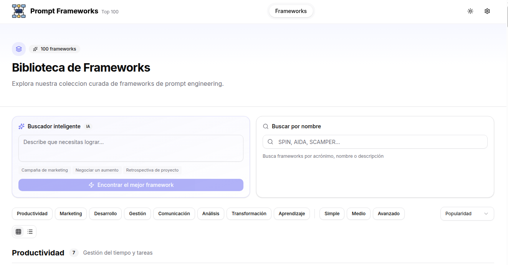
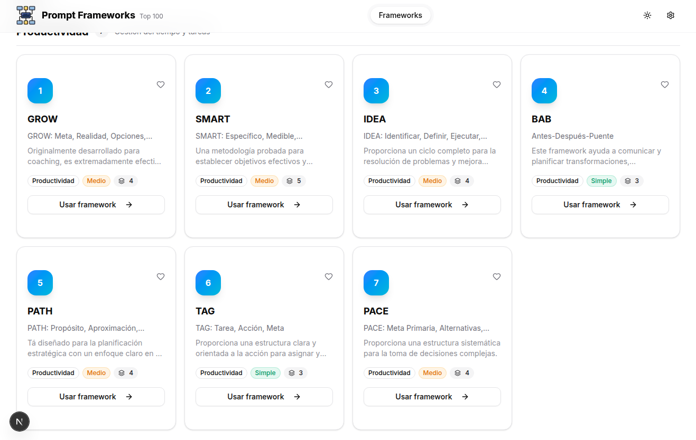
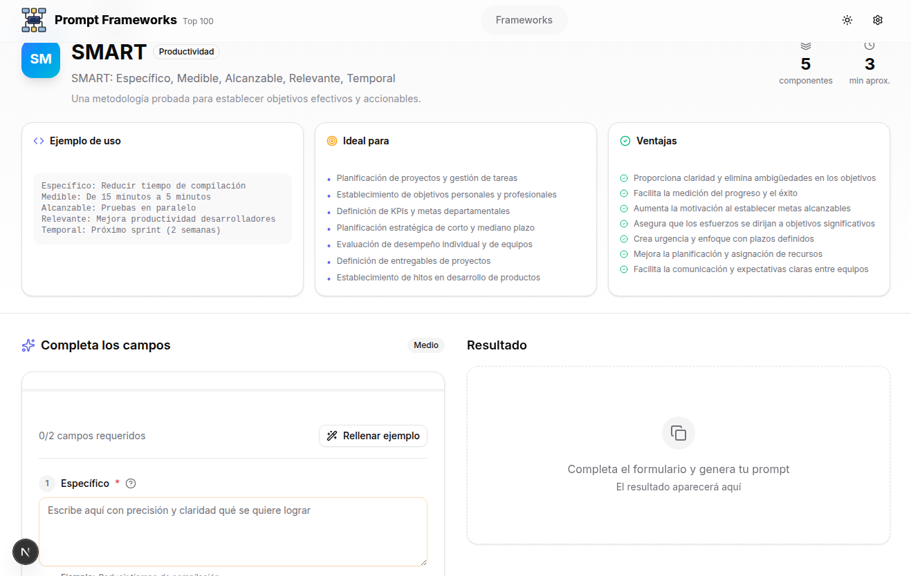

# Top 100 Frameworks para Prompt Engineering

[](https://nextjs.org/)
[](https://www.typescriptlang.org/)
[](https://tailwindcss.com/)
[](LICENSE)

Una colección curada de **100 frameworks de prompt engineering** con un sistema inteligente de recomendación y generación de prompts efectivos. Esta herramienta ayuda a desarrolladores, creadores de contenido y profesionales a estructurar mejor sus interacciones con modelos de lenguaje como ChatGPT, Claude, Gemini y otros.


### Biblioteca de Frameworks

La página de inicio presenta la biblioteca completa con un buscador inteligente que permite encontrar frameworks por nombre, descripción o categoría. El sistema de filtros lateral facilita la exploración por categoría, complejidad y popularidad.



### Grid de Frameworks

Los frameworks se muestran en tarjetas informativas que incluyen el nombre, acrónimo, categoría, descripción resumida y nivel de complejidad. El diseño responsive se adapta a diferentes tamaños de pantalla, mostrando desde una columna en móvil hasta cuatro columnas en pantallas grandes.



### Detalle del Framework

Cada framework cuenta con una página detallada que muestra todos sus componentes, descripción completa, ejemplos de uso, casos recomendados y ventajas. Desde esta vista se puede acceder directamente al generador de prompts con el framework seleccionado.



### Configuración de Modelo de IA

El panel de configuración permite seleccionar entre los diferentes modelos de IA disponibles a través de OpenRouter. Cada modelo muestra su proveedor, características principales y es ideal para diferentes tipos de tareas.


## El Problema

El prompt engineering se ha convertido en una habilidad fundamental para trabajar con modelos de inteligencia artificial. Sin embargo, la mayoría de usuarios enfrentan varios desafíos al intentar obtener respuestas precisas y útiles de estos sistemas.

En primer lugar, existe una falta de estructura en la comunicación con las IAs. Las personas tienden a escribir prompts vagos o ambiguos que generan respuestas igualmente imprecisas. No hay un método claro para organizar el contexto, los requisitos y las expectativas de manera que el modelo pueda procesarlos eficientemente.

Además, la curva de aprendizaje es pronunciada. Aunque existen cientos de técnicas y metodologías documentadas, están dispersas por internet en diferentes formatos, idiomas y niveles de detalle. Un profesional que necesita mejorar sus prompts debe invertir horas investigando qué técnica usar para cada situación específica.

Finalmente, hay una desconexión entre la teoría y la práctica. Conocer un framework como STAR o SMART no significa saber aplicarlo correctamente en un prompt. Los usuarios necesitan guía paso a paso y ejemplos concretos para cada componente del framework.

## La Solución

Este proyecto ofrece una solución integral al problema del prompt engineering mediante tres pilares fundamentales que trabajan de forma conjunta para maximizar la efectividad de las interacciones con IA.

El primer pilar es la colección estructurada de 100 frameworks. Cada framework está documentado con su descripción completa, los componentes que lo forman, ejemplos de uso, casos recomendados y ventajas específicas. Todo está organizado en 8 categorías temáticas que facilitan la navegación y el descubrimiento.

El segundo pilar es el sistema de recomendación inteligente. Utilizando modelos de IA a través de OpenRouter, el sistema analiza el objetivo que el usuario quiere lograr y sugiere el framework más adecuado para esa situación. Esto elimina la barrera de tener que conocer todos los frameworks antes de poder elegir uno.

El tercer pilar es el generador de prompts. Una vez seleccionado un framework, el usuario puede rellenar cada componente con su información específica y el sistema genera automáticamente un prompt estructurado y optimizado, listo para copiar y usar en cualquier modelo de IA.

## Los 100 Frameworks

La colección incluye frameworks probados y efectivos para una amplia variedad de situaciones. Desde clásicos como SMART y SWOT hasta metodologías especializadas para desarrollo de software, marketing y gestión de proyectos.

### Distribución por Categorías

| Categoría | Cantidad | Descripción |
|-----------|----------|-------------|
| Development | 43 | Frameworks técnicos para desarrollo de software, arquitectura y programación |
| Management | 14 | Metodologías para gestión de proyectos, equipos y recursos |
| Communication | 12 | Técnicas para comunicación efectiva, presentaciones y documentación |
| Analysis | 11 | Herramientas para análisis, toma de decisiones y resolución de problemas |
| Marketing | 9 | Frameworks para marketing, ventas y comunicación persuasiva |
| Productivity | 7 | Metodologías para productividad personal y profesional |
| Learning | 2 | Técnicas para aprendizaje y desarrollo de habilidades |
| Transformation | 2 | Frameworks para gestión del cambio organizacional |

### Frameworks Destacados

Entre los 100 frameworks incluidos se encuentran algunos de los más utilizados en la industria. SPIN (Situación, Problema, Implicación, Necesidad) es excelente para presentar soluciones técnicas de manera persuasiva. MECE (Mutuamente Exclusivo, Colectivamente Exhaustivo) ayuda a estructurar análisis complejos sin redundancias ni omisiones.

Para objetivos y resultados, OKR (Objectives and Key Results) permite definir metas claras con métricas medibles. SMART añade criterios de especificidad, medibilidad, alcanzabilidad, relevancia y temporalidad. GROW (Goal, Reality, Options, Way forward) es ideal para coaching y resolución de problemas paso a paso.

En el ámbito técnico, frameworks como CODE (Contexto, Objetivo, Desarrollo, Evaluación), BUILD (Base, Understanding, Implementation, Learning, Delivery) y EXPERT proporcionan estructuras específicas para documentación técnica, desarrollo de proyectos y transferencia de conocimiento.

## Modelos de IA

El sistema utiliza OpenRouter como gateway para acceder a múltiples modelos de inteligencia artificial. Esta arquitectura permite ofrecer flexibilidad y redundancia sin necesidad de gestionar múltiples API keys o integraciones.

### Modelos Disponibles

Los modelos han sido seleccionados por su equilibrio entre calidad, velocidad y coste. Qwen QWQ 32B es el modelo principal para generación de prompts, destacando por sus capacidades de razonamiento profundo y pensamiento extendido que producen resultados más elaborados y contextualizados.

DeepSeek Chat V3 se utiliza para las recomendaciones de frameworks por su velocidad de respuesta y excelente comprensión del contexto. Es capaz de analizar rápidamente el objetivo del usuario y mapear las características con los frameworks disponibles.

Kimi K2 de Moonshot AI está disponible como alternativa premium con una ventana de contexto de 128K tokens, útil para proyectos que requieren procesar grandes cantidades de información de referencia.

Todos los modelos son accesibles mediante una única API key de OpenRouter, simplificando la configuración y el mantenimiento del sistema.

## Tecnologías

El stack tecnológico ha sido elegido priorizando la experiencia de desarrollo moderna, el rendimiento y la mantenibilidad a largo plazo.

**Next.js 16** con App Router proporciona la base del proyecto. El uso de Turbopack acelera significativamente los tiempos de desarrollo con hot reload prácticamente instantáneo. Server Components y Client Components están utilizados estratégicamente para optimizar la carga inicial y la interactividad.

**TypeScript** en modo estricto garantiza la seguridad de tipos en todo el código base. Los tipos están definidos centralmente en `/src/types` y son reutilizados tanto en el frontend como en las API routes, eliminando inconsistencias entre cliente y servidor.

**Tailwind CSS** junto con **shadcn/ui** proporciona un sistema de diseño coherente y accesible. Los componentes de shadcn/ui están construidos sobre Radix UI, garantizando accesibilidad WCAG 2.1 AA out of the box.

**Zustand** gestiona el estado global de la aplicación con stores para frameworks, generador y configuración. Su API minimalista reduce el boilerplate comparado con alternativas como Redux.

**Zod** valida todos los datos de entrada en las API routes, proporcionando mensajes de error descriptivos y tipos TypeScript inferidos automáticamente.

## Instalación

El proceso de instalación es directo y requiere únicamente Node.js 18 o superior.

```bash
# Clonar el repositorio
git clone https://github.com/686f6c61/top-100-frameworks-prompt-engineering.git

# Entrar al directorio
cd top-100-frameworks-prompt-engineering

# Instalar dependencias
npm install

# Configurar variables de entorno
cp .env.example .env.local
# Editar .env.local y añadir tu OPENROUTER_API_KEY

# Iniciar servidor de desarrollo
npm run dev
```

La aplicación estará disponible en `http://localhost:3000`. La API key de OpenRouter es necesaria para las funcionalidades de IA (recomendación y generación), pero la navegación por los frameworks funciona sin ella.

## Estructura del Proyecto

```
src/
├── app/                    # App Router de Next.js
│   ├── api/               # API Routes
│   │   ├── ai/           # Endpoints de IA
│   │   │   ├── generate/ # Generación de prompts
│   │   │   └── recommend/# Recomendación de frameworks
│   │   └── frameworks/   # CRUD de frameworks
│   ├── frameworks/       # Página principal de exploración
│   ├── generator/        # Generador de prompts
│   │   └── [id]/        # Generador por framework
│   └── settings/         # Configuración
├── components/
│   ├── frameworks/       # Componentes de frameworks
│   ├── generator/        # Componentes del generador
│   ├── layout/          # Header, Footer
│   ├── shared/          # Componentes compartidos
│   └── ui/              # shadcn/ui components
├── config/              # Configuración de la app
├── data/
│   └── frameworks/      # JSON con los 100 frameworks
├── lib/
│   ├── ai/             # Cliente OpenRouter y prompts
│   └── frameworks/     # Lógica de datos de frameworks
├── stores/             # Zustand stores
└── types/              # Tipos TypeScript
```

## API Endpoints

La API REST expone los siguientes endpoints para interactuar con el sistema programáticamente.

### GET /api/frameworks

Retorna la lista de frameworks con soporte para filtrado, búsqueda y ordenación.

```
Query params:
- search: string (búsqueda por nombre o descripción)
- category: string (filtro por categoría)
- complexity: simple|medium|advanced
- sort: popularity|name|complexity
- order: asc|desc
```

### GET /api/frameworks/[id]

Retorna los detalles completos de un framework específico incluyendo todos sus componentes, ejemplos y metadatos.

### POST /api/ai/recommend

Analiza un objetivo y recomienda el framework más adecuado.

```json
{
  "objective": "Necesito estructurar una propuesta técnica",
  "context": "technical"
}
```

### POST /api/ai/generate

Genera un prompt estructurado basado en un framework y los datos proporcionados.

```json
{
  "frameworkId": "smart",
  "formData": {
    "specific": "Aumentar ventas online",
    "measurable": "20% incremento",
    ...
  },
  "objective": "Crear plan de marketing Q1"
}
```

## Contribuir

Las contribuciones son bienvenidas y apreciadas. El proyecto sigue un flujo estándar de GitHub con issues y pull requests.

Para contribuir con nuevos frameworks, el formato JSON está documentado en `/src/types/framework.ts`. Cada framework debe incluir todos los campos requeridos: id, acronym, fullName, category, description, components (con id, name, description, placeholder y required), example, useCases, advantages, tags y complexity.

Para mejoras de código, se recomienda abrir un issue primero para discutir los cambios propuestos. El proyecto usa ESLint y Prettier para mantener consistencia en el estilo de código.

## Licencia

Este proyecto está licenciado bajo la Licencia MIT. Consulta el archivo [LICENSE](LICENSE) para más detalles.

---

Desarrollado con ❤️ por [686f6c61](https://github.com/686f6c61)
